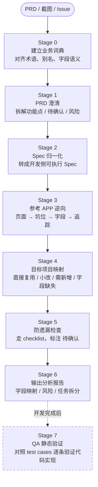

# Frontend Requirement Mapper

Turn requirement analysis into a fixed evidence-driven workflow instead of ad hoc prompting.

Use this skill for tasks like:
- Read a PRD and clarify vague points
- Normalize a vague PRD into a development-facing spec
- Reverse-analyze a reference app or reference codebase
- Compare `reference app behavior -> target project capability -> field mapping`
- Produce a frontend requirement analysis or technical solution draft
- Build a gap list, risk list, and confirmation list before implementation

## Inputs

Ask for or infer these inputs before starting:
- PRD text, markdown, screenshots, or issue links
- Reference app name and any code/file clues
- Target project path or repo slice to inspect
- Optional business glossary, naming cheatsheet, or example requirement docs
- Optional constraints: deadline, output file path, expected doc format

If an input is missing, proceed with the available evidence and mark gaps as `待确认`.

## Workflow



## Default Workflow

Follow these stages in order. Do not skip directly to a final solution draft.

0. Establish the business vocabulary
If the user provides business terms, aliases, abbreviations, slot names, or field semantics, normalize them first.

Use [references/domain-glossary-template.md](references/domain-glossary-template.md) as the preferred structure for business vocabulary.

1. Clarify the PRD
Read the PRD and extract:
- business goal
- user flow
- pages/modules
- slots or placement positions
- fields and display rules
- unclear points and contradictions

Use [references/workflow.md](references/workflow.md) for the stage-by-stage procedure.

2. Normalize into a spec
Convert the PRD into a development-facing spec before code mapping.

Use:
- [assets/spec-template.md](assets/spec-template.md)
- [references/spec-gap-checklist.md](references/spec-gap-checklist.md)

The spec should distinguish:
- confirmed requirements
- missing definitions
- acceptance criteria
- out-of-scope items

3. Reverse the reference app
Locate the relevant entry points, components, APIs, state, tracking, and field usage in the reference app or reference code.

Use [references/search-playbook.md](references/search-playbook.md) for concrete search patterns.

4. Map into the target project
Compare the reference behavior with the target project and classify each function point as:
- `直接复用`
- `小改`
- `需新增`
- `字段缺失`
- `待确认`

5. Run the anti-omission pass
Before finalizing, walk through [references/checklist.md](references/checklist.md) and explicitly call out risks, unknowns, and likely blind spots.

6. Produce the report
Generate a structured markdown report using [assets/requirement-analysis-template.md](assets/requirement-analysis-template.md).

7. QA static verification (post-development closure)
When development is complete and test cases are available, verify each case against the implementation statically — without running the code.

Use:
- [references/qa-playbook.md](references/qa-playbook.md) for the step-by-step verification method
- [assets/qa-record-template.md](assets/qa-record-template.md) for recording and documenting results

The key verification steps are:
- Locate the validation function and understand which type system value reaches it
- Extract the regex or rule from the implementation
- Verify happy path, boundary values, disallowed characters, case sensitivity, and empty/blank inputs
- Check the UI constraint layer (`maxlength`, `input type`) independently from the logic layer
- Record all results in a structured table and write to the project doc

If the user wants a file created first, scaffold it with:

```bash
bash scripts/scaffold_report.sh path/to/output.md
```

## Evidence Discipline

Every non-trivial claim should be grounded in evidence when code is available. Prefer:
- file paths
- component or hook names
- API names
- field names
- route names
- tracking event names

Label unsupported conclusions as `推测` or `待确认`. Do not present guesses as facts.

## Clarification Policy

Do not interrupt the user for every uncertainty.

Proceed without asking if:
- the ambiguity does not change the likely search path
- the ambiguity does not affect field mapping or implementation scope
- the issue can be safely marked as `待确认` in the output

Ask the user to confirm only if the ambiguity changes one of these:
- which page, module, or slot should be analyzed
- which reference app behavior is the correct source of truth
- which fields are semantically equivalent
- whether a function point is in or out of scope
- whether a risky implementation decision would be made from the assumption

When asking for clarification:
- ask short, concrete questions
- show the conflicting interpretations
- explain what decision is blocked
- keep working on non-blocked parts if possible

## Output Contract

Always include:
- requirement summary
- spec normalization result
- reference app findings
- target project mapping
- field mapping
- impact scope
- risk and omission list
- confirmation questions
- implementation task breakdown
- test points

When possible, include clickable file references in the final answer.

## Working Style

Prefer small batches of evidence collection:
- search first
- inspect candidate files
- confirm the true source of data
- then summarize

Do not stop at surface UI files if the task involves slot behavior or fields. Trace into:
- route config
- container/page component
- child components
- hooks/store
- API layer
- tracking/report code
- config/feature-flag logic

## Resource Guide

- Workflow details: [references/workflow.md](references/workflow.md)
- Business glossary template: [references/domain-glossary-template.md](references/domain-glossary-template.md)
- Spec template: [assets/spec-template.md](assets/spec-template.md)
- Spec gap checklist: [references/spec-gap-checklist.md](references/spec-gap-checklist.md)
- Search heuristics: [references/search-playbook.md](references/search-playbook.md)
- Anti-omission checklist: [references/checklist.md](references/checklist.md)
- Report template: [assets/requirement-analysis-template.md](assets/requirement-analysis-template.md)
- QA static verification: [references/qa-playbook.md](references/qa-playbook.md)
- QA record template: [assets/qa-record-template.md](assets/qa-record-template.md)
